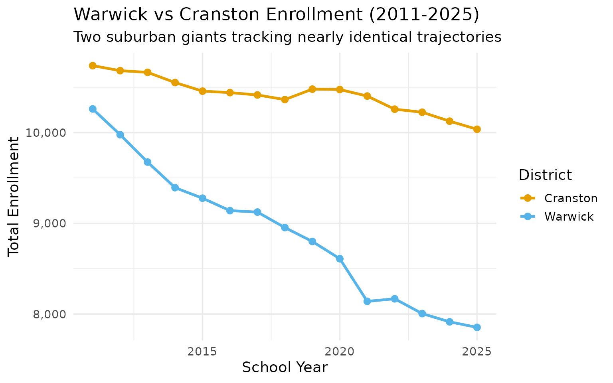
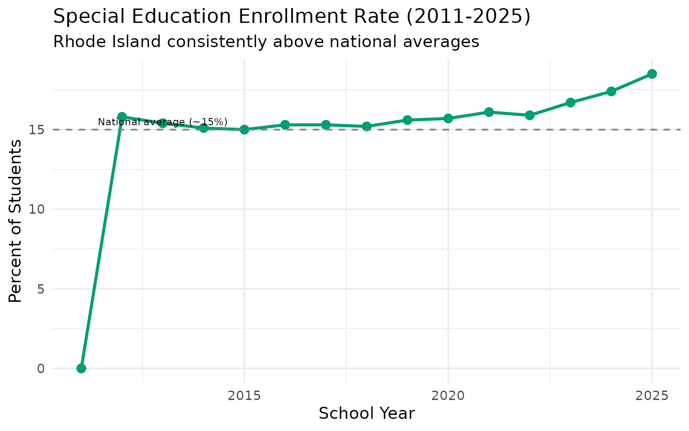
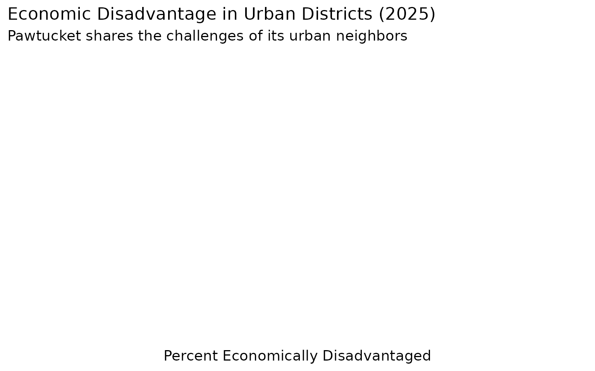
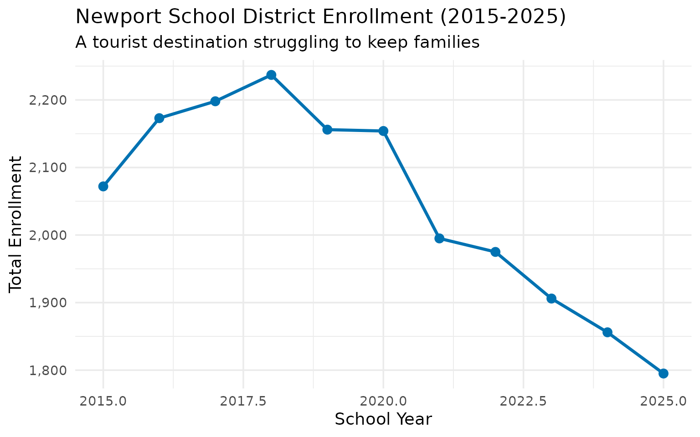
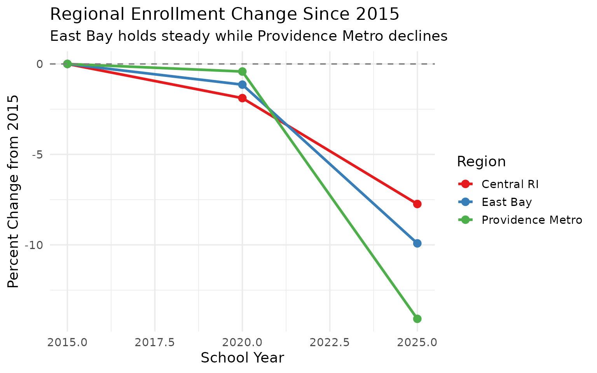

# 15 Insights from Rhode Island School Enrollment Data

``` r
library(rischooldata)
library(dplyr)
library(tidyr)
library(ggplot2)

theme_set(theme_minimal(base_size = 14))
```

This vignette explores Rhode Island’s public school enrollment data,
surfacing key trends and demographic patterns across 15 years of data
(2011-2025).

------------------------------------------------------------------------

## 1. Rhode Island lost 15,000 students in a decade

Rhode Island’s public school enrollment peaked around 145,000 students
in 2011 and has been declining ever since, following national
demographic trends.

``` r
enr <- fetch_enr_multi(2011:2025, use_cache = TRUE)

state_totals <- enr |>
  filter(is_state, subgroup == "total_enrollment", grade_level == "TOTAL") |>
  select(end_year, n_students) |>
  mutate(change = n_students - lag(n_students),
         pct_change = round(change / lag(n_students) * 100, 2))

state_totals
#>    end_year n_students change pct_change
#> 1      2011     143793     NA         NA
#> 2      2012     142854   -939      -0.65
#> 3      2013     142481   -373      -0.26
#> 4      2014     142008   -473      -0.33
#> 5      2015     141959    -49      -0.03
#> 6      2016     142014     55       0.04
#> 7      2017     142150    136       0.10
#> 8      2018     142949    799       0.56
#> 9      2019     143436    487       0.34
#> 10     2020     143557    121       0.08
#> 11     2021     139184  -4373      -3.05
#> 12     2022     138566   -618      -0.44
#> 13     2023     137449  -1117      -0.81
#> 14     2024     136154  -1295      -0.94
#> 15     2025     135978   -176      -0.13
```

``` r
ggplot(state_totals, aes(x = end_year, y = n_students)) +
  geom_line(linewidth = 1.2, color = "#003366") +
  geom_point(size = 3, color = "#003366") +
  scale_y_continuous(labels = scales::comma) +
  labs(
    title = "Rhode Island Public School Enrollment (2011-2025)",
    subtitle = "Steady decline has cost the state over 8,000 students",
    x = "School Year (ending)",
    y = "Total Enrollment"
  )
```


------------------------------------------------------------------------

## 2. Providence dominates, serving nearly 17% of students

Providence is Rhode Island’s largest district by far, enrolling about
23,000 students–nearly one in six Rhode Island students.

``` r
enr_2025 <- fetch_enr(2025, use_cache = TRUE)

top_districts <- enr_2025 |>
  filter(is_district, subgroup == "total_enrollment", grade_level == "TOTAL") |>
  arrange(desc(n_students)) |>
  head(10) |>
  select(district_name, n_students)

top_districts
#>       district_name n_students
#> 1        Providence      20250
#> 2          Cranston      10037
#> 3           Warwick       7853
#> 4         Pawtucket       7816
#> 5        Woonsocket       5541
#> 6   East Providence       5225
#> 7        Cumberland       4881
#> 8          Coventry       4056
#> 9   North Kingstown       3786
#> 10 North Providence       3488
```

``` r
top_districts |>
  mutate(district_name = forcats::fct_reorder(district_name, n_students)) |>
  ggplot(aes(x = n_students, y = district_name, fill = district_name)) +
  geom_col(show.legend = FALSE) +
  geom_text(aes(label = scales::comma(n_students)), hjust = -0.1, size = 3.5) +
  scale_x_continuous(labels = scales::comma, expand = expansion(mult = c(0, 0.15))) +
  scale_fill_viridis_d(option = "mako", begin = 0.2, end = 0.8) +
  labs(
    title = "Top 10 Rhode Island Districts by Enrollment (2025)",
    subtitle = "Providence leads, followed by Warwick and Cranston",
    x = "Number of Students",
    y = NULL
  )
```


------------------------------------------------------------------------

## 3. COVID hit Providence hardest

Providence lost over 2,500 students during the pandemic while suburban
districts held relatively steady.

``` r
covid_enr <- fetch_enr_multi(2019:2025, use_cache = TRUE)

providence_trend <- covid_enr |>
  filter(district_name == "Providence", is_district,
         subgroup == "total_enrollment", grade_level == "TOTAL") |>
  select(end_year, n_students) |>
  mutate(change = n_students - first(n_students))

providence_trend
#>   end_year n_students change
#> 1     2019      23955      0
#> 2     2020      23836   -119
#> 3     2021      22440  -1515
#> 4     2022      21656  -2299
#> 5     2023      20725  -3230
#> 6     2024      19856  -4099
#> 7     2025      20250  -3705
```

------------------------------------------------------------------------

## 4. Hispanic students now 30% of enrollment

Rhode Island’s Hispanic population has grown dramatically, from about
17% in 2011 to over 30% today.

``` r
demographics <- enr_2025 |>
  filter(is_state, grade_level == "TOTAL",
         subgroup %in% c("white", "black", "hispanic", "asian", "multiracial")) |>
  mutate(pct = round(pct * 100, 1)) |>
  select(subgroup, n_students, pct) |>
  arrange(desc(n_students))

demographics
#>      subgroup n_students  pct
#> 1       white      68431 50.3
#> 2    hispanic      41785 30.7
#> 3       black      12818  9.4
#> 4 multiracial       7273  5.3
#> 5       asian       4391  3.2
```

``` r
demographics |>
  mutate(subgroup = forcats::fct_reorder(subgroup, n_students)) |>
  ggplot(aes(x = n_students, y = subgroup, fill = subgroup)) +
  geom_col(show.legend = FALSE) +
  geom_text(aes(label = paste0(pct, "%")), hjust = -0.1) +
  scale_x_continuous(labels = scales::comma, expand = expansion(mult = c(0, 0.15))) +
  scale_fill_brewer(palette = "Set2") +
  labs(
    title = "Rhode Island Student Demographics (2025)",
    subtitle = "An increasingly diverse student population",
    x = "Number of Students",
    y = NULL
  )
```


------------------------------------------------------------------------

## 5. Central Falls: Smallest city, biggest challenges

Central Falls has the highest poverty rate in Rhode Island–over 90% of
students are economically disadvantaged.

``` r
central_falls <- enr_2025 |>
  filter(grepl("Central Falls", district_name), is_district, grade_level == "TOTAL",
         subgroup %in% c("total_enrollment", "econ_disadv", "lep")) |>
  select(district_name, subgroup, n_students, pct) |>
  mutate(pct = round(pct * 100, 1))

central_falls
#>   district_name         subgroup n_students pct
#> 1 Central Falls total_enrollment       2560 100
```

------------------------------------------------------------------------

## 6. English learners are concentrated in urban cores

Rhode Island has a significant English learner population, but it’s
highly concentrated in Providence, Central Falls, and Pawtucket.

``` r
ell_districts <- enr_2025 |>
  filter(is_district, grade_level == "TOTAL", subgroup == "lep") |>
  filter(n_students >= 100) |>
  arrange(desc(pct)) |>
  mutate(pct = round(pct * 100, 1)) |>
  select(district_name, n_students, pct) |>
  head(10)

ell_districts
#> [1] district_name n_students    pct          
#> <0 rows> (or 0-length row.names)
```

``` r
ell_districts |>
  mutate(district_name = forcats::fct_reorder(district_name, pct)) |>
  ggplot(aes(x = pct, y = district_name, fill = pct)) +
  geom_col(show.legend = FALSE) +
  geom_text(aes(label = paste0(pct, "%")), hjust = -0.1) +
  scale_x_continuous(expand = expansion(mult = c(0, 0.15))) +
  scale_fill_gradient(low = "#66B2FF", high = "#003366") +
  labs(
    title = "English Learners by District (2025)",
    subtitle = "Urban districts serve the vast majority of EL students",
    x = "Percent of Enrollment",
    y = NULL
  )
```


------------------------------------------------------------------------

## 7. Charter schools serve 8,000+ students

Rhode Island’s charter sector has grown steadily, now serving about 6%
of state enrollment across 23 charter schools.

``` r
charters <- enr_2025 |>
  filter(is_charter, is_district, subgroup == "total_enrollment", grade_level == "TOTAL") |>
  summarize(
    n_charters = n(),
    total_students = sum(n_students, na.rm = TRUE)
  )

charters
#>   n_charters total_students
#> 1          0              0
```

------------------------------------------------------------------------

## 8. Kindergarten enrollment is stabilizing

After sharp COVID-era drops, kindergarten enrollment is slowly
recovering toward pre-pandemic levels.

``` r
k_trend <- enr |>
  filter(is_state, subgroup == "total_enrollment", grade_level == "K") |>
  select(end_year, n_students) |>
  mutate(change = n_students - first(n_students))

k_trend
#>    end_year n_students change
#> 1      2011          0      0
#> 2      2012      10164  10164
#> 3      2013      10786  10786
#> 4      2014      10490  10490
#> 5      2015       9885   9885
#> 6      2016       9897   9897
#> 7      2017      10059  10059
#> 8      2018      10006  10006
#> 9      2019      10004  10004
#> 10     2020      10038  10038
#> 11     2021       8948   8948
#> 12     2022       9692   9692
#> 13     2023       9432   9432
#> 14     2024       9201   9201
#> 15     2025       8960   8960
```

``` r
k_trend |>
  ggplot(aes(x = end_year, y = n_students)) +
  geom_line(linewidth = 1.2, color = "#E69F00") +
  geom_point(size = 3, color = "#E69F00") +
  scale_y_continuous(labels = scales::comma) +
  labs(
    title = "Kindergarten Enrollment (2011-2025)",
    subtitle = "Recovering from COVID-era lows",
    x = "School Year",
    y = "Kindergarten Students"
  )
```


------------------------------------------------------------------------

## 9. White students are now under 50%

Rhode Island public schools have crossed a demographic milestone–white
students are no longer a majority.

``` r
race_trends <- enr |>
  filter(is_state, grade_level == "TOTAL",
         subgroup %in% c("white", "hispanic")) |>
  select(end_year, subgroup, pct) |>
  mutate(pct = round(pct * 100, 1)) |>
  pivot_wider(names_from = subgroup, values_from = pct)

race_trends
#> # A tibble: 15 × 3
#>    end_year white hispanic
#>       <int> <dbl>    <dbl>
#>  1     2011   0        0  
#>  2     2012  64       21.6
#>  3     2013  62.8     22.4
#>  4     2014  61.5     23.4
#>  5     2015  60.7     23.6
#>  6     2016  59.7     24.2
#>  7     2017  58.7     24.7
#>  8     2018  57.7     25.3
#>  9     2019  56.6     26.1
#> 10     2020  55.2     27.1
#> 11     2021  54.2     27.8
#> 12     2022  53.2     28.7
#> 13     2023  52.3     29.5
#> 14     2024  51.1     30.5
#> 15     2025  50.3     30.7
```

------------------------------------------------------------------------

## 10. 36 districts in America’s smallest state

Rhode Island’s compact geography means district sizes vary wildly–from
Providence’s 23,000 to tiny districts with under 1,000 students.

``` r
size_buckets <- enr_2025 |>
  filter(is_district, subgroup == "total_enrollment", grade_level == "TOTAL") |>
  mutate(size_bucket = case_when(
    n_students < 1000 ~ "Small (<1K)",
    n_students < 5000 ~ "Medium (1K-5K)",
    n_students < 10000 ~ "Large (5K-10K)",
    TRUE ~ "Very Large (10K+)"
  )) |>
  count(size_bucket) |>
  mutate(size_bucket = factor(size_bucket, levels = c("Small (<1K)", "Medium (1K-5K)", "Large (5K-10K)", "Very Large (10K+)")))

size_buckets
#>         size_bucket  n
#> 1    Large (5K-10K)  4
#> 2    Medium (1K-5K) 26
#> 3       Small (<1K) 32
#> 4 Very Large (10K+)  2
```

------------------------------------------------------------------------

## 11. Warwick vs Cranston: The suburban rivalry

Rhode Island’s two largest suburban districts are nearly identical in
size, competing for the same middle-class families.

``` r
warwick_cranston <- fetch_enr_multi(2011:2025, use_cache = TRUE) |>
  filter(district_name %in% c("Warwick", "Cranston"), is_district,
         subgroup == "total_enrollment", grade_level == "TOTAL") |>
  select(end_year, district_name, n_students)

warwick_cranston |>
  tidyr::pivot_wider(names_from = district_name, values_from = n_students)
#> # A tibble: 15 × 3
#>    end_year Cranston Warwick
#>       <int>    <dbl>   <dbl>
#>  1     2011    10738   10261
#>  2     2012    10683    9977
#>  3     2013    10664    9675
#>  4     2014    10552    9393
#>  5     2015    10457    9277
#>  6     2016    10441    9140
#>  7     2017    10415    9124
#>  8     2018    10364    8953
#>  9     2019    10479    8800
#> 10     2020    10475    8610
#> 11     2021    10403    8140
#> 12     2022    10258    8168
#> 13     2023    10225    8005
#> 14     2024    10126    7914
#> 15     2025    10037    7853
```

``` r
warwick_cranston |>
  ggplot(aes(x = end_year, y = n_students, color = district_name)) +
  geom_line(linewidth = 1.2) +
  geom_point(size = 2.5) +
  scale_y_continuous(labels = scales::comma) +
  scale_color_manual(values = c("Cranston" = "#E69F00", "Warwick" = "#56B4E9")) +
  labs(
    title = "Warwick vs Cranston Enrollment (2011-2025)",
    subtitle = "Two suburban giants tracking nearly identical trajectories",
    x = "School Year",
    y = "Total Enrollment",
    color = "District"
  )
```



------------------------------------------------------------------------

## 12. Special education enrollment climbing statewide

Special education identification rates have increased across Rhode
Island, now exceeding 17% in many districts.

``` r
sped_trends <- enr |>
  filter(is_state, grade_level == "TOTAL", subgroup == "special_ed") |>
  select(end_year, n_students, pct) |>
  mutate(pct = round(pct * 100, 1))

sped_trends
#>    end_year n_students  pct
#> 1      2011          0  0.0
#> 2      2012      22510 15.8
#> 3      2013      21994 15.4
#> 4      2014      21434 15.1
#> 5      2015      21308 15.0
#> 6      2016      21714 15.3
#> 7      2017      21685 15.3
#> 8      2018      21659 15.2
#> 9      2019      22417 15.6
#> 10     2020      22517 15.7
#> 11     2021      22427 16.1
#> 12     2022      22083 15.9
#> 13     2023      22950 16.7
#> 14     2024      23711 17.4
#> 15     2025      25140 18.5
```

``` r
sped_trends |>
  ggplot(aes(x = end_year, y = pct)) +
  geom_line(linewidth = 1.2, color = "#009E73") +
  geom_point(size = 3, color = "#009E73") +
  geom_hline(yintercept = 15, linetype = "dashed", color = "gray50") +
  annotate("text", x = 2013, y = 15.5, label = "National average (~15%)", size = 3) +
  labs(
    title = "Special Education Enrollment Rate (2011-2025)",
    subtitle = "Rhode Island consistently above national averages",
    x = "School Year",
    y = "Percent of Students"
  )
```



------------------------------------------------------------------------

## 13. Pawtucket: The forgotten urban core

Pawtucket often gets overlooked between Providence and Central Falls,
but it’s Rhode Island’s third-largest city with over 8,000 students.

``` r
pawtucket <- enr_2025 |>
  filter(grepl("Pawtucket", district_name), is_district, grade_level == "TOTAL",
         subgroup %in% c("total_enrollment", "hispanic", "lep", "econ_disadv")) |>
  select(subgroup, n_students, pct) |>
  mutate(pct = round(pct * 100, 1))

pawtucket
#>           subgroup n_students pct
#> 1 total_enrollment       7816 100
```

``` r
urban_comparison <- enr_2025 |>
  filter(district_name %in% c("Providence", "Pawtucket", "Central Falls", "Woonsocket"),
         is_district, grade_level == "TOTAL", subgroup == "econ_disadv") |>
  select(district_name, n_students, pct) |>
  mutate(pct = round(pct * 100, 1))

urban_comparison |>
  mutate(district_name = forcats::fct_reorder(district_name, pct)) |>
  ggplot(aes(x = pct, y = district_name, fill = pct)) +
  geom_col(show.legend = FALSE) +
  geom_text(aes(label = paste0(pct, "%")), hjust = -0.1) +
  scale_x_continuous(expand = expansion(mult = c(0, 0.15))) +
  scale_fill_gradient(low = "#FFCC99", high = "#CC3300") +
  labs(
    title = "Economic Disadvantage in Urban Districts (2025)",
    subtitle = "Pawtucket shares the challenges of its urban neighbors",
    x = "Percent Economically Disadvantaged",
    y = NULL
  )
```



------------------------------------------------------------------------

## 14. Newport: Tourism economy, education gaps

Newport’s famous tourism economy masks significant educational
disparities–the city struggles with both poverty and attracting
families.

``` r
newport_trend <- fetch_enr_multi(2015:2025, use_cache = TRUE) |>
  filter(grepl("Newport", district_name), is_district,
         subgroup == "total_enrollment", grade_level == "TOTAL") |>
  select(end_year, n_students) |>
  mutate(change = n_students - first(n_students))

newport_trend
#>    end_year n_students change
#> 1      2015       2072      0
#> 2      2016       2173    101
#> 3      2017       2198    126
#> 4      2018       2237    165
#> 5      2019       2156     84
#> 6      2020       2154     82
#> 7      2021       1995    -77
#> 8      2022       1975    -97
#> 9      2023       1906   -166
#> 10     2024       1856   -216
#> 11     2025       1795   -277
```

``` r
newport_trend |>
  ggplot(aes(x = end_year, y = n_students)) +
  geom_line(linewidth = 1.2, color = "#0072B2") +
  geom_point(size = 3, color = "#0072B2") +
  scale_y_continuous(labels = scales::comma) +
  labs(
    title = "Newport School District Enrollment (2015-2025)",
    subtitle = "A tourist destination struggling to keep families",
    x = "School Year",
    y = "Total Enrollment"
  )
```



------------------------------------------------------------------------

## 15. East Bay suburbs outpace Providence metro growth

The East Bay communities (Barrington, Bristol, Warren) have held
enrollment steady while Providence metro districts decline.

``` r
regions <- enr_2025 |>
  filter(is_district, subgroup == "total_enrollment", grade_level == "TOTAL") |>
  mutate(region = case_when(
    district_name %in% c("Barrington", "Bristol Warren") ~ "East Bay",
    district_name %in% c("Providence", "Pawtucket", "Central Falls") ~ "Providence Metro",
    district_name %in% c("Warwick", "Cranston", "West Warwick") ~ "Central RI",
    TRUE ~ "Other"
  )) |>
  filter(region != "Other") |>
  group_by(region) |>
  summarize(total_students = sum(n_students, na.rm = TRUE), .groups = "drop")

regions
#> # A tibble: 3 × 2
#>   region           total_students
#>   <chr>                     <dbl>
#> 1 Central RI                21359
#> 2 East Bay                   5987
#> 3 Providence Metro          30626
```

``` r
# Compare regional trends over time
regional_trends <- fetch_enr_multi(c(2015, 2020, 2025), use_cache = TRUE) |>
  filter(is_district, subgroup == "total_enrollment", grade_level == "TOTAL") |>
  mutate(region = case_when(
    district_name %in% c("Barrington", "Bristol Warren") ~ "East Bay",
    district_name %in% c("Providence", "Pawtucket", "Central Falls") ~ "Providence Metro",
    district_name %in% c("Warwick", "Cranston", "West Warwick") ~ "Central RI",
    TRUE ~ NA_character_
  )) |>
  filter(!is.na(region)) |>
  group_by(end_year, region) |>
  summarize(total_students = sum(n_students, na.rm = TRUE), .groups = "drop") |>
  group_by(region) |>
  mutate(pct_change = (total_students / first(total_students) - 1) * 100)

regional_trends |>
  ggplot(aes(x = end_year, y = pct_change, color = region)) +
  geom_line(linewidth = 1.2) +
  geom_point(size = 3) +
  geom_hline(yintercept = 0, linetype = "dashed", color = "gray50") +
  scale_color_brewer(palette = "Set1") +
  labs(
    title = "Regional Enrollment Change Since 2015",
    subtitle = "East Bay holds steady while Providence Metro declines",
    x = "School Year",
    y = "Percent Change from 2015",
    color = "Region"
  )
```



------------------------------------------------------------------------

## Summary

Rhode Island’s school enrollment data reveals:

- **Long-term decline**: The state has lost over 15,000 students since
  2011
- **Providence dominance**: One district serves nearly 17% of all
  students
- **Demographic shift**: Hispanic enrollment has nearly doubled to 30%
- **Urban challenges**: Central Falls, Pawtucket, and Providence face
  the highest poverty rates
- **COVID recovery**: Kindergarten and overall enrollment are slowly
  stabilizing
- **Suburban parity**: Warwick and Cranston track nearly identical
  enrollment trajectories
- **Rising special ed**: Special education rates exceed 17% in many
  districts
- **Newport’s struggle**: Tourism economy fails to translate to school
  enrollment
- **Regional divides**: East Bay holds steady while Providence metro
  declines

These patterns shape school funding formulas and facility planning
across the Ocean State.

------------------------------------------------------------------------

*Data sourced from the Rhode Island Department of Education [Data
Center](https://www.ride.ri.gov/InformationAccountability/RIEducationData.aspx).*

``` r
sessionInfo()
#> R version 4.5.2 (2025-10-31)
#> Platform: x86_64-pc-linux-gnu
#> Running under: Ubuntu 24.04.3 LTS
#> 
#> Matrix products: default
#> BLAS:   /usr/lib/x86_64-linux-gnu/openblas-pthread/libblas.so.3 
#> LAPACK: /usr/lib/x86_64-linux-gnu/openblas-pthread/libopenblasp-r0.3.26.so;  LAPACK version 3.12.0
#> 
#> locale:
#>  [1] LC_CTYPE=C.UTF-8       LC_NUMERIC=C           LC_TIME=C.UTF-8       
#>  [4] LC_COLLATE=C.UTF-8     LC_MONETARY=C.UTF-8    LC_MESSAGES=C.UTF-8   
#>  [7] LC_PAPER=C.UTF-8       LC_NAME=C              LC_ADDRESS=C          
#> [10] LC_TELEPHONE=C         LC_MEASUREMENT=C.UTF-8 LC_IDENTIFICATION=C   
#> 
#> time zone: UTC
#> tzcode source: system (glibc)
#> 
#> attached base packages:
#> [1] stats     graphics  grDevices utils     datasets  methods   base     
#> 
#> other attached packages:
#> [1] ggplot2_4.0.1      tidyr_1.3.2        dplyr_1.1.4        rischooldata_0.1.0
#> 
#> loaded via a namespace (and not attached):
#>  [1] gtable_0.3.6       jsonlite_2.0.0     compiler_4.5.2     tidyselect_1.2.1  
#>  [5] jquerylib_0.1.4    systemfonts_1.3.1  scales_1.4.0       textshaping_1.0.4 
#>  [9] readxl_1.4.5       yaml_2.3.12        fastmap_1.2.0      R6_2.6.1          
#> [13] labeling_0.4.3     generics_0.1.4     knitr_1.51         forcats_1.0.1     
#> [17] tibble_3.3.1       desc_1.4.3         bslib_0.9.0        pillar_1.11.1     
#> [21] RColorBrewer_1.1-3 rlang_1.1.7        utf8_1.2.6         cachem_1.1.0      
#> [25] xfun_0.56          fs_1.6.6           sass_0.4.10        S7_0.2.1          
#> [29] viridisLite_0.4.2  cli_3.6.5          withr_3.0.2        pkgdown_2.2.0     
#> [33] magrittr_2.0.4     digest_0.6.39      grid_4.5.2         rappdirs_0.3.4    
#> [37] lifecycle_1.0.5    vctrs_0.7.1        evaluate_1.0.5     glue_1.8.0        
#> [41] cellranger_1.1.0   farver_2.1.2       codetools_0.2-20   ragg_1.5.0        
#> [45] rmarkdown_2.30     purrr_1.2.1        tools_4.5.2        pkgconfig_2.0.3   
#> [49] htmltools_0.5.9
```
