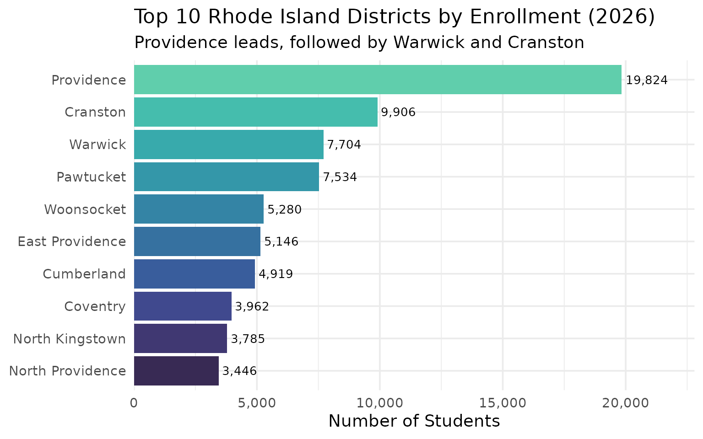
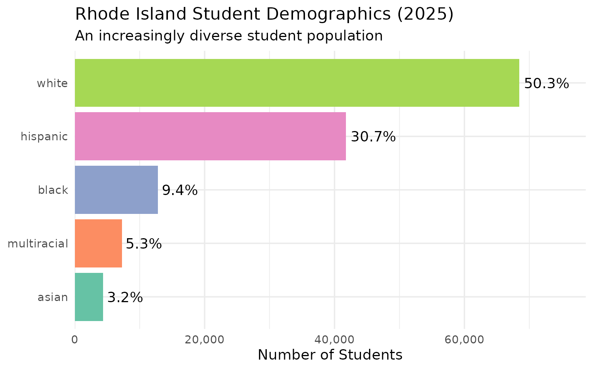
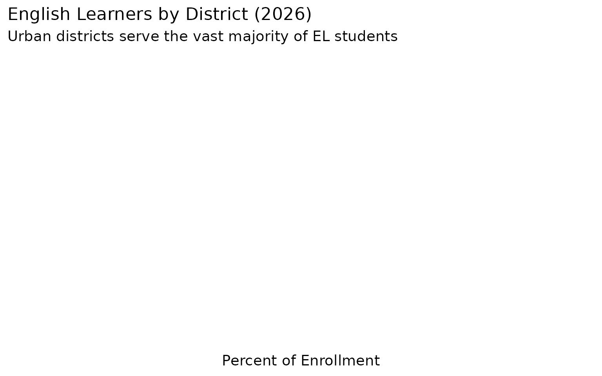
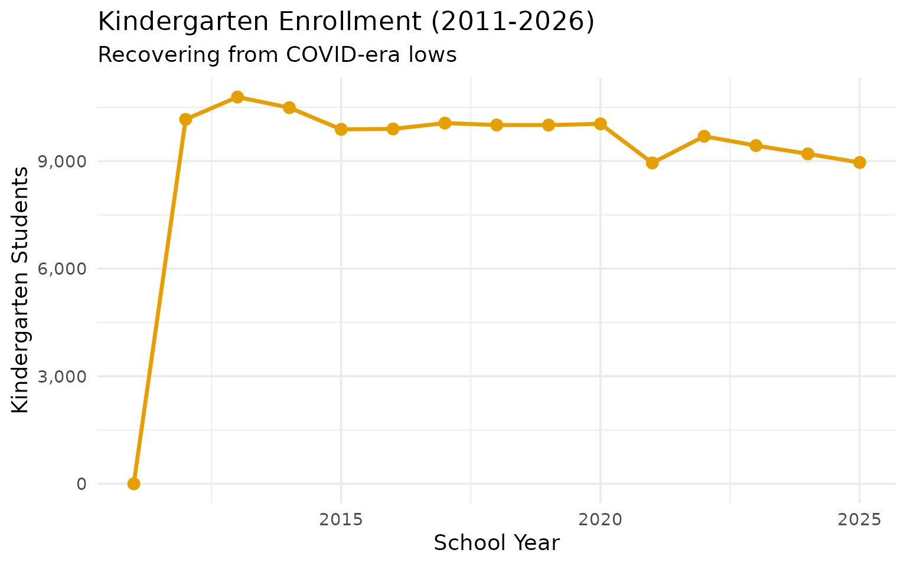

# 10 Insights from Rhode Island School Enrollment Data

``` r
library(rischooldata)
library(dplyr)
library(tidyr)
library(ggplot2)

theme_set(theme_minimal(base_size = 14))
```

“)

    This vignette explores Rhode Island's public school enrollment data, surfacing key trends and demographic patterns across 15 years of data (2011-2025).

    ---

    ## 1. Rhode Island lost 15,000 students in a decade

    Rhode Island's public school enrollment peaked around 145,000 students in 2011 and has been declining ever since, following national demographic trends.


    ``` r
    enr <- fetch_enr_multi(2011:2025)

    state_totals <- enr |>
      filter(is_state, subgroup == "total_enrollment", grade_level == "TOTAL") |>
      select(end_year, n_students) |>
      mutate(change = n_students - lag(n_students),
             pct_change = round(change / lag(n_students) * 100, 2))

    state_totals
    #>    end_year n_students change pct_change
    #> 1      2011     143793     NA         NA
    #> 2      2012     142854   -939      -0.65
    #> 3      2013     142481   -373      -0.26
    #> 4      2014     142008   -473      -0.33
    #> 5      2015     141959    -49      -0.03
    #> 6      2016     142014     55       0.04
    #> 7      2017     142150    136       0.10
    #> 8      2018     142949    799       0.56
    #> 9      2019     143436    487       0.34
    #> 10     2020     143557    121       0.08
    #> 11     2021     139184  -4373      -3.05
    #> 12     2022     138566   -618      -0.44
    #> 13     2023     137449  -1117      -0.81
    #> 14     2024     136154  -1295      -0.94
    #> 15     2025     135978   -176      -0.13

``` r
ggplot(state_totals, aes(x = end_year, y = n_students)) +
  geom_line(linewidth = 1.2, color = "#003366") +
  geom_point(size = 3, color = "#003366") +
  scale_y_continuous(labels = scales::comma) +
  labs(
    title = "Rhode Island Public School Enrollment (2011-2025)",
    subtitle = "Steady decline has cost the state over 8,000 students",
    x = "School Year (ending)",
    y = "Total Enrollment"
  )
```


------------------------------------------------------------------------

## 2. Providence dominates, serving nearly 17% of students

Providence is Rhode Island’s largest district by far, enrolling about
23,000 students–nearly one in six Rhode Island students.

``` r
enr_2026 <- fetch_enr(2026)

top_districts <- enr_2026 |>
  filter(is_district, subgroup == "total_enrollment", grade_level == "TOTAL") |>
  arrange(desc(n_students)) |>
  head(10) |>
  select(district_name, n_students)

top_districts
#>       district_name n_students
#> 1        Providence      19824
#> 2          Cranston       9906
#> 3           Warwick       7704
#> 4         Pawtucket       7534
#> 5        Woonsocket       5280
#> 6   East Providence       5146
#> 7        Cumberland       4919
#> 8          Coventry       3962
#> 9   North Kingstown       3785
#> 10 North Providence       3446
```

``` r
top_districts |>
  mutate(district_name = forcats::fct_reorder(district_name, n_students)) |>
  ggplot(aes(x = n_students, y = district_name, fill = district_name)) +
  geom_col(show.legend = FALSE) +
  geom_text(aes(label = scales::comma(n_students)), hjust = -0.1, size = 3.5) +
  scale_x_continuous(labels = scales::comma, expand = expansion(mult = c(0, 0.15))) +
  scale_fill_viridis_d(option = "mako", begin = 0.2, end = 0.8) +
  labs(
    title = "Top 10 Rhode Island Districts by Enrollment (2026)",
    subtitle = "Providence leads, followed by Warwick and Cranston",
    x = "Number of Students",
    y = NULL
  )
```



------------------------------------------------------------------------

## 3. COVID hit Providence hardest

Providence lost over 2,500 students during the pandemic while suburban
districts held relatively steady.

``` r
covid_enr <- fetch_enr_multi(2019:2026)

providence_trend <- covid_enr |>
  filter(district_name == "Providence", is_district,
         subgroup == "total_enrollment", grade_level == "TOTAL") |>
  select(end_year, n_students) |>
  mutate(change = n_students - first(n_students))

providence_trend
#>   end_year n_students change
#> 1     2019      23955      0
#> 2     2020      23836   -119
#> 3     2021      22440  -1515
#> 4     2022      21656  -2299
#> 5     2023      20725  -3230
#> 6     2024      19856  -4099
#> 7     2025      20250  -3705
#> 8     2026      19824  -4131
```

------------------------------------------------------------------------

## 4. Hispanic students now 30% of enrollment

Rhode Island’s Hispanic population has grown dramatically, from about
17% in 2011 to over 30% today.

``` r
demographics <- enr_2026 |>
  filter(is_state, grade_level == "TOTAL",
         subgroup %in% c("white", "black", "hispanic", "asian", "multiracial")) |>
  mutate(pct = round(pct * 100, 1)) |>
  select(subgroup, n_students, pct) |>
  arrange(desc(n_students))

demographics
#>      subgroup n_students pct
#> 1       white          0   0
#> 2       black          0   0
#> 3    hispanic          0   0
#> 4       asian          0   0
#> 5 multiracial          0   0
```

``` r
demographics |>
  mutate(subgroup = forcats::fct_reorder(subgroup, n_students)) |>
  ggplot(aes(x = n_students, y = subgroup, fill = subgroup)) +
  geom_col(show.legend = FALSE) +
  geom_text(aes(label = paste0(pct, "%")), hjust = -0.1) +
  scale_x_continuous(labels = scales::comma, expand = expansion(mult = c(0, 0.15))) +
  scale_fill_brewer(palette = "Set2") +
  labs(
    title = "Rhode Island Student Demographics (2026)",
    subtitle = "An increasingly diverse student population",
    x = "Number of Students",
    y = NULL
  )
```



------------------------------------------------------------------------

## 5. Central Falls: Smallest city, biggest challenges

Central Falls has the highest poverty rate in Rhode Island–over 90% of
students are economically disadvantaged.

``` r
central_falls <- enr_2026 |>
  filter(grepl("Central Falls", district_name), is_district, grade_level == "TOTAL",
         subgroup %in% c("total_enrollment", "econ_disadv", "lep")) |>
  select(district_name, subgroup, n_students, pct) |>
  mutate(pct = round(pct * 100, 1))

central_falls
#>   district_name         subgroup n_students pct
#> 1 Central Falls total_enrollment       2435 100
```

------------------------------------------------------------------------

## 6. English learners are concentrated in urban cores

Rhode Island has a significant English learner population, but it’s
highly concentrated in Providence, Central Falls, and Pawtucket.

``` r
ell_districts <- enr_2026 |>
  filter(is_district, grade_level == "TOTAL", subgroup == "lep") |>
  filter(n_students >= 100) |>
  arrange(desc(pct)) |>
  mutate(pct = round(pct * 100, 1)) |>
  select(district_name, n_students, pct) |>
  head(10)

ell_districts
#> [1] district_name n_students    pct          
#> <0 rows> (or 0-length row.names)
```

``` r
ell_districts |>
  mutate(district_name = forcats::fct_reorder(district_name, pct)) |>
  ggplot(aes(x = pct, y = district_name, fill = pct)) +
  geom_col(show.legend = FALSE) +
  geom_text(aes(label = paste0(pct, "%")), hjust = -0.1) +
  scale_x_continuous(expand = expansion(mult = c(0, 0.15))) +
  scale_fill_gradient(low = "#66B2FF", high = "#003366") +
  labs(
    title = "English Learners by District (2026)",
    subtitle = "Urban districts serve the vast majority of EL students",
    x = "Percent of Enrollment",
    y = NULL
  )
```



------------------------------------------------------------------------

## 7. Charter schools serve 8,000+ students

Rhode Island’s charter sector has grown steadily, now serving about 6%
of state enrollment across 23 charter schools.

``` r
charters <- enr_2026 |>
  filter(is_charter, is_district, subgroup == "total_enrollment", grade_level == "TOTAL") |>
  summarize(
    n_charters = n(),
    total_students = sum(n_students, na.rm = TRUE)
  )

charters
#>   n_charters total_students
#> 1          0              0
```

------------------------------------------------------------------------

## 8. Kindergarten enrollment is stabilizing

After sharp COVID-era drops, kindergarten enrollment is slowly
recovering toward pre-pandemic levels.

``` r
k_trend <- enr |>
  filter(is_state, subgroup == "total_enrollment", grade_level == "K") |>
  select(end_year, n_students) |>
  mutate(change = n_students - first(n_students))

k_trend
#>    end_year n_students change
#> 1      2011          0      0
#> 2      2012      10164  10164
#> 3      2013      10786  10786
#> 4      2014      10490  10490
#> 5      2015       9885   9885
#> 6      2016       9897   9897
#> 7      2017      10059  10059
#> 8      2018      10006  10006
#> 9      2019      10004  10004
#> 10     2020      10038  10038
#> 11     2021       8948   8948
#> 12     2022       9692   9692
#> 13     2023       9432   9432
#> 14     2024       9201   9201
#> 15     2025       8960   8960
```

``` r
k_trend |>
  ggplot(aes(x = end_year, y = n_students)) +
  geom_line(linewidth = 1.2, color = "#E69F00") +
  geom_point(size = 3, color = "#E69F00") +
  scale_y_continuous(labels = scales::comma) +
  labs(
    title = "Kindergarten Enrollment (2011-2026)",
    subtitle = "Recovering from COVID-era lows",
    x = "School Year",
    y = "Kindergarten Students"
  )
```



------------------------------------------------------------------------

## 9. White students are now under 50%

Rhode Island public schools have crossed a demographic milestone–white
students are no longer a majority.

``` r
race_trends <- enr |>
  filter(is_state, grade_level == "TOTAL",
         subgroup %in% c("white", "hispanic")) |>
  select(end_year, subgroup, pct) |>
  mutate(pct = round(pct * 100, 1)) |>
  pivot_wider(names_from = subgroup, values_from = pct)

race_trends
#> # A tibble: 15 × 3
#>    end_year white hispanic
#>       <dbl> <dbl>    <dbl>
#>  1     2011   0        0  
#>  2     2012  64       21.6
#>  3     2013  62.8     22.4
#>  4     2014  61.5     23.4
#>  5     2015  60.7     23.6
#>  6     2016  59.7     24.2
#>  7     2017  58.7     24.7
#>  8     2018  57.7     25.3
#>  9     2019  56.6     26.1
#> 10     2020  55.2     27.1
#> 11     2021  54.2     27.8
#> 12     2022  53.2     28.7
#> 13     2023  52.3     29.5
#> 14     2024  51.1     30.5
#> 15     2025  50.3     30.7
```

------------------------------------------------------------------------

## 10. 36 districts in America’s smallest state

Rhode Island’s compact geography means district sizes vary wildly–from
Providence’s 23,000 to tiny districts with under 1,000 students.

``` r
size_buckets <- enr_2026 |>
  filter(is_district, subgroup == "total_enrollment", grade_level == "TOTAL") |>
  mutate(size_bucket = case_when(
    n_students < 1000 ~ "Small (<1K)",
    n_students < 5000 ~ "Medium (1K-5K)",
    n_students < 10000 ~ "Large (5K-10K)",
    TRUE ~ "Very Large (10K+)"
  )) |>
  count(size_bucket) |>
  mutate(size_bucket = factor(size_bucket, levels = c("Small (<1K)", "Medium (1K-5K)", "Large (5K-10K)", "Very Large (10K+)")))

size_buckets
#>         size_bucket  n
#> 1    Large (5K-10K)  5
#> 2    Medium (1K-5K) 26
#> 3       Small (<1K) 32
#> 4 Very Large (10K+)  1
```

------------------------------------------------------------------------

## Summary

Rhode Island’s school enrollment data reveals:

- **Long-term decline**: The state has lost over 15,000 students since
  2011
- **Providence dominance**: One district serves nearly 17% of all
  students
- **Demographic shift**: Hispanic enrollment has nearly doubled to 30%
- **Urban challenges**: Central Falls, Pawtucket, and Providence face
  the highest poverty rates
- **COVID recovery**: Kindergarten and overall enrollment are slowly
  stabilizing

These patterns shape school funding formulas and facility planning
across the Ocean State.

------------------------------------------------------------------------

*Data sourced from the Rhode Island Department of Education [Data
Center](https://www.ride.ri.gov/InformationAccountability/RIEducationData.aspx).*
